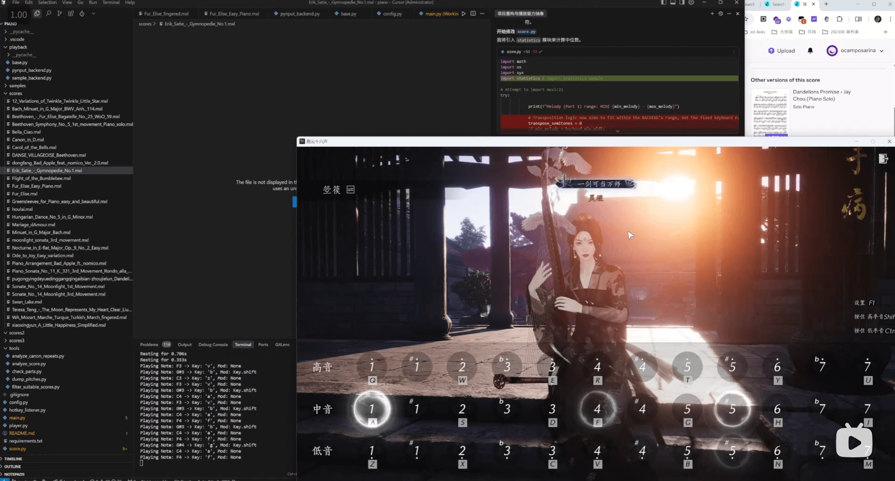

# MusicXML 键盘播放器

本项目允许你使用电脑键盘模拟弹奏 MusicXML 格式的乐谱。它通过读取 `.mxl` 或 `.musicxml` 文件，将其音符映射到键盘按键，并使用 `pynput` 库模拟按键操作。

## 演示 (Demo)

[](https://www.bilibili.com/video/BV1WAGZzSExy/)

[点击查看 Bilibili 演示视频](https://www.bilibili.com/video/BV1WAGZzSExy/)

## 功能特性

* **MusicXML 解析**: 使用 `music21` 库加载和解析乐谱文件。
* **键盘映射**: 将乐谱音符（考虑音高和八度）映射到标准 QWERTY 键盘按键。
  * 中音区（C4-B4）: `a, s, d, f, g, h, j` (对应 1 到 7)
  * 高音区（C5-B5）: `q, w, e, r, t, y, u` (对应 1̇ 到 7̇)
  * 低音区（C3-B3）: `z, x, c, v, b, n, m` (对应 1̣ 到 7̣)
  * 升号 (#): `Shift` + 对应按键
  * 降号 (b): `Ctrl` + 对应按键
* **自动移调/模式选择**:
  * 如果乐谱完整音域在键盘可表示范围（C3-B5，可通过 `--tolerance` 参数调整容差）内，则播放所有声部。
  * 如果超出范围，则默认仅播放第一声部（通常是旋律），并自动进行八度移调以适应键盘范围。
* **播放模式**: 支持顺序播放或随机播放 `scores/` 目录下的乐谱。
* **热键控制**: 通过功能键 (F7-F11, Esc) 控制乐谱选择和播放。
* **自动连播**: 乐曲自然结束后，暂停 3 秒后自动播放下一首（根据播放模式选择）。

## 安装与设置

1. **克隆仓库**:

    ```bash
    git clone <your-repository-url>
    cd piano # 或者你的项目目录名
    ```

2. **安装依赖**: 本项目主要依赖 `music21`, `pynput`, 和 `pygame`。
    * 或者，可以直接使用 `requirements.txt` 安装所有依赖:

        ```bash
        pip install -r requirements.txt
        ```

    * **music21**: 这是一个强大的音乐学分析库。根据 [music21 安装文档](https://web.mit.edu/music21/doc/usersGuide/usersGuide_01_installing.html)，可能需要一些额外的配置（例如设置 MusicXML 阅读器路径，如 MuseScore 或 Finale）。
    * **pynput**: 用于监听和控制键盘输入。
    * **pygame**: 用于 `sample` 后端播放音频文件。

3. **准备乐谱和音频样本**:
    * **乐谱**: 将你的 `.mxl` 或 `.musicxml` 格式的乐谱文件放入项目根目录下由 `--directory` 参数指定的文件夹中（默认为 `scores`）。**现在支持将乐谱整理到该目录的子文件夹中，程序会自动递归查找。**
    * **音频样本 (可选, 用于 `sample` 后端)**: 将单个音符的音频文件（推荐 `.mp3` 或 `.wav` 格式）放入 `samples/piano/` 目录下。文件名需要能被 `sample_backend.py` 中的 `NOTE_SAMPLE_MAP` 字典正确映射（当前脚本基于您提供的 JS 映射）。如果使用 `sample` 后端但缺少文件，程序会打印警告但仍可运行（缺失音符无声）。

## 如何运行

在项目根目录下运行主程序 `main.py`:

```bash
python main.py [选项]
```

**命令行选项**:

* `-m MODE`, `--mode MODE`: 设置播放模式 (`sequential` | `random` (默认))。
* `-t TOLERANCE`, `--tolerance TOLERANCE`: 设置音高容差（MIDI 音程数, 默认 `0`）。用于判断是否播放完整乐谱还是仅旋律声部。
* `-b BACKEND`, `--backend BACKEND`: 选择播放后端。
  * `pynput` (默认): 通过模拟键盘按键播放。有效音域约为 C3-B5（根据 `config.py`）。
  * `sample`: 通过播放 `samples/piano/` 目录下的音频文件播放。有效音域取决于 `samples/piano/` 中提供的样本文件（当前配置约为 C2-G#6）。
  * `midi`: 通过MIDI输出播放。支持完整的MIDI音域（0-127），最准确地表现音符的持续时间和音量。需要 `python-rtmidi` 库。
* `-d DIRECTORY`, `--directory DIRECTORY`: 指定包含 MusicXML 乐谱文件的目录路径。默认为 `scores`。
* `--midi-port PORT_NAME`: 指定MIDI端口名称（仅适用于MIDI后端）。默认使用第一个可用端口或创建虚拟端口。

## 热键控制

程序运行时，通过以下热键进行控制：

* **`F7`**: 选择 **上一首** 乐谱。仅选择，不自动播放。
* **`F8`**: 选择 **下一首** 乐谱。仅选择，不自动播放。
* **`F9`**: **开始/恢复** 播放。
  * 如果当前没有播放：开始播放当前选定（通过 F7/F8 选择）的乐谱。如果 F7/F8 未选择过，则根据 `--mode` 选择下一首播放。
  * 如果当前已暂停：恢复播放。
  * 如果当前正在播放：无效果（提示 F11 暂停）。
* **`F10`**: **停止** 当前播放。
* **`F11`**: **暂停/恢复** 当前播放。
* **`Esc`**: **退出** 程序。会先停止当前播放。

## 工具脚本 (`tools/`)

`tools/` 目录下包含一些辅助分析乐谱的脚本：

* `analyze_score.py`: 分析单个乐谱文件的音域、时长、调性等信息。
* `check_parts.py`: 检查乐谱文件包含哪些声部（Part）。
* `dump_pitches.py`: 提取乐谱中的所有音高信息。
* `filter_suitable_scores.py`: 用于根据音域范围筛选乐谱。例如，将 `scores2/` (默认源目录, 可在脚本内修改) 中符合条件的乐谱移动到 `scores/` (默认目标目录)。**注意：此脚本需要从项目根目录运行。**
  * 示例 (筛选 C3-B5 范围，或旋律部分可被移调至此范围的乐谱):

        ```bash
        python tools/filter_suitable_scores.py --tolerance 0 --include-melody-fallback
        ```

  * 更多用法请查看脚本内部说明或运行 `python tools/filter_suitable_scores.py -h`。

这些脚本通常用于调试或预处理乐谱，可以直接使用 `python tools/<script_name.py> [arguments]` 运行 (filter脚本需在项目根目录)。

## 注意事项

* 键盘模拟是全局性的。请确保在播放时没有聚焦在需要输入的窗口，以免产生意外输入。
* `music21` 解析复杂乐谱可能需要较长时间和较多内存。
* 不同操作系统和环境下的 `pynput` 行为可能略有差异。
* **管理员权限**: 在 Windows 上，通常不需要管理员权限即可运行 `main.py`。但如果你想将模拟按键发送到 **以管理员权限运行** 的其他应用程序，则 `main.py` 也需要以管理员权限运行。在其他操作系统（如 macOS 或某些 Linux 配置）上，全局键盘监听或控制可能需要特殊权限设置。
* **后端局限性**:
  * **pynput 后端**: 由于是通过模拟键盘按键播放，无法实现长音的持续发声效果。当遇到tied notes（连音符）时，每个音符都会被单独触发，导致长音听起来像是重复的短音符。无法实现真正的音量控制。
  * **sample 后端**: 使用预录制的音频样本，虽然支持音量控制，但音频样本本身具有自然衰减特性，不适合持续播放长音。对于tied notes，样本的重新触发会导致听感不自然。
  * **解决方案**: 现已实现MIDI后端，可精确控制音符持续时间。使用命令 `python main.py -b midi` 启动MIDI版本。

## 精确还原乐谱标记

我们致力于尽可能精确地还原乐谱中的标记信息，以提升播放的真实感。目前已支持：

* **力度 (Dynamics):** 识别乐谱中的 *pp, p, mf, f, ff* 等标记并调整音量（`sample` 后端）。
* **速度变化 (Tempo Changes):** 识别并应用乐谱中的速度标记 (`MetronomeMark`)。
* **发音 - 断奏 (Articulation - Staccato):** 识别音符上的断奏标记 (小圆点 `·`)，并缩短其播放后的等待时间，以产生短促、分离的效果。
* **延音踏板 (Sustain Pedal):** (尚未实现) 计划支持识别乐谱中的踏板标记 (`Ped.` 和 `*`) 并模拟其效果。

## 致谢 (Acknowledgements)

* 本项目使用的钢琴音频样本 (`samples/piano/`) 来源于 [Wscats/piano](https://github.com/Wscats/piano)。
* `scores/` 目录下的部分乐谱来源于 [musetrainer/library](https://github.com/musetrainer/library)。
